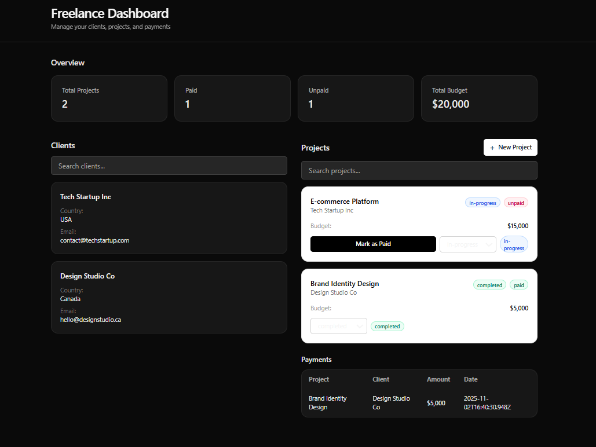

## Freelance Dashboard (React + TypeScript)
A mini-dashboard for freelancers to manage clients, projects, and payments. Built with React + TypeScript, Context API + useReducer, and Tailwind CSS for styling.

---

## Screenshot

![Screenshot]

---

## Technologies Used
React + TypeScript
Context API + useReducer
Tailwind CSS
Vite (dev/build)

---

## Main Features
Typed data models: 
Client
, 
Project
, 
Payment
Global state with typed reducer and discriminated union actions
Clients list with search (name, country, optional email)
Projects list with:
Project title and linked client
Status: pending | in-progress | completed
Payment status: paid | unpaid
Mark-as-paid action creates a payment and updates state
Payments table: project, client, amount, ISO date
Overview stats: Total Projects, Paid, Unpaid, Total Budget
Inline “New Project” form:
Project title
Client name (creates client if not found), optional email and country
Optional budget

---

## Setup Instructions
Clone
git clone https://github.com/Boldecca/Dashboard-freelance.git
cd Dashboard-freelance
Install
npm install
Run
npm run dev
Open the printed local URL (for example http://localhost:5175)

---

## Folder Structure
Dashboard-freelance/
├─ .git/
├─ .gitignore
├─ README.md
├─ eslint.config.js
├─ image.png
├─ index.html
├─ package-lock.json
├─ package.json
├─ public/
├─ src/
│  ├─ App.css
│  ├─ App.tsx
│  ├─ assets/
│  ├─ components/
│  │  ├─ ClientCard.tsx
│  │  ├─ DashboardStats.tsx
│  │  ├─ PaymentsList.tsx
│  │  ├─ ProjectList.tsx
│  │  └─ TasksPanel.tsx
│  ├─ index.css
│  ├─ main.tsx
│  ├─ models.ts
│  ├─ state/
│  │  ├─ actions.ts
│  │  └─ context.tsx
│  └─ utils.ts
├─ tsconfig.app.json
├─ tsconfig.json
├─ tsconfig.node.json
└─ vite.config.ts
---

## Example Data
Seeded in 
src/state/actions.ts
:

2 clients
2 projects (linked to those clients)
1 payment

## Deployment

live demo: https://dashboard-freelance-gamma.vercel.app/